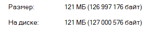

# Сбор и аналитическая обработка информации о сетевом трафике
Смирнов Михаил

## Цель работы

1.  Развить практические навыки использования современного стека
    инструментов сбора и аналитической обработки информации о сетевом
    трафике

2.  Освоить базовые подходы блокировки нежелательного сетевого трафика

3.  Закрепить знания о современных сетевых протоколах прикладного уровня

## План

1.  Получение трафика

2.  Перевод трафика в метаинформацию

3.  Анализ трафика

4.  Определение нежелательного трафика

## Шаги

1\. Получение трафика

С помощью Wireshark было захвачено 121 МБ трафика (файл trafic.pcapng).



2\. Перевод трафика в метаинформацию

С помощью утилиты zeek была получена метаинформация о трафике (файл
dns.log).

``` bash
/opt/zeek/bin/zeek -C -r /home/mihmoh/trafic.pcapng
```

3\. Анализ трафика

Для анализа трафика необходимо получить список нежелательных доменов.

``` bash
curl https://winhelp2002.mvps.org/hosts.txt -o hosts
```

      % Total    % Received % Xferd  Average Speed   Time    Time     Time  Current
                                     Dload  Upload   Total   Spent    Left  Speed

      0     0    0     0    0     0      0      0 --:--:-- --:--:-- --:--:--     0
      0     0    0     0    0     0      0      0 --:--:-- --:--:-- --:--:--     0
      0     0    0     0    0     0      0      0 --:--:--  0:00:01 --:--:--     0
      0     0    0     0    0     0      0      0 --:--:--  0:00:02 --:--:--     0
      0     0    0     0    0     0      0      0 --:--:--  0:00:03 --:--:--     0
      0     0    0     0    0     0      0      0 --:--:--  0:00:04 --:--:--     0
      0     0    0     0    0     0      0      0 --:--:--  0:00:05 --:--:--     0
      0     0    0     0    0     0      0      0 --:--:--  0:00:06 --:--:--     0
      0     0    0     0    0     0      0      0 --:--:--  0:00:07 --:--:--     0
     14  327k   14 49152    0     0   5740      0  0:00:58  0:00:08  0:00:50  9767
    100  327k  100  327k    0     0  33324      0  0:00:10  0:00:10 --:--:-- 60696
    100  327k  100  327k    0     0  33323      0  0:00:10  0:00:10 --:--:-- 74149

С помощью Python подготовим файл для анализа:

``` python
bad_hosts = []
with open('hosts') as file:
    for line in file.readlines()[27:]:
        if line[0] == '#':
            continue
        bad_hosts.append(line.split()[1])
```

Преобразуем полученную метаинформацию в пригодный к анализу вид:

``` python
hosts = []
with open('dns.log') as file:
    for line in file.readlines():
        if line[0] == '#':
            continue
        try:
            hosts.append(line.split()[9])
        except IndexError:
            continue
```

4\. Определение нежелательного трафика

Проанализируем полученный трафик:

``` python
bad_count = len([host for host in hosts if host in bad_hosts])
percentile = round(bad_count/len(hosts),3)*100
print("{} вхождений DNS в список нежелательного трафика.".format(str(bad_count)),
"Процент нежелательного трафика: {}%.".format(str(percentile)),sep='\n')
```

    37 вхождений DNS в список нежелательного трафика.
    Процент нежелательного трафика: 4.8%.

## Оценка результата

В результате лабораторной работы мы смогли определить нежелательный
трафик.

## Вывод

Таким образом, мы научились анализировать сетевой трафик и, используя
современный стек инструментов, освоили подход блокировки нежелательного
сетевого трафика на основе чёрного списка.
