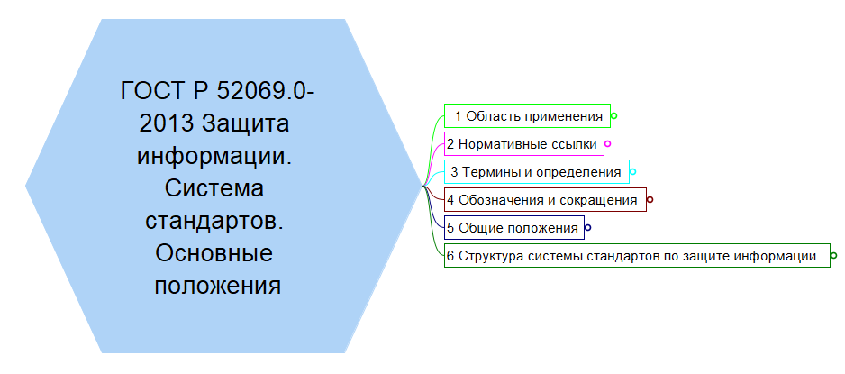
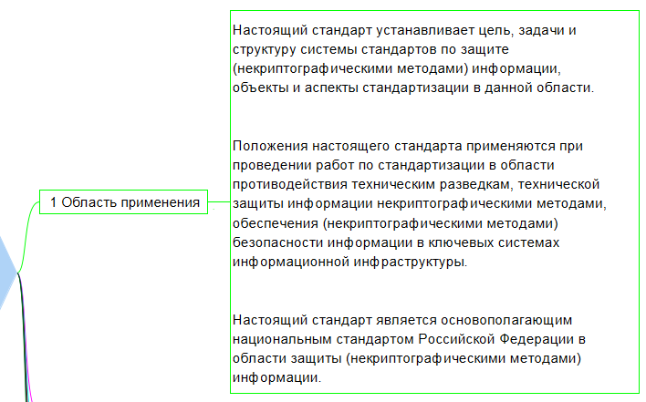
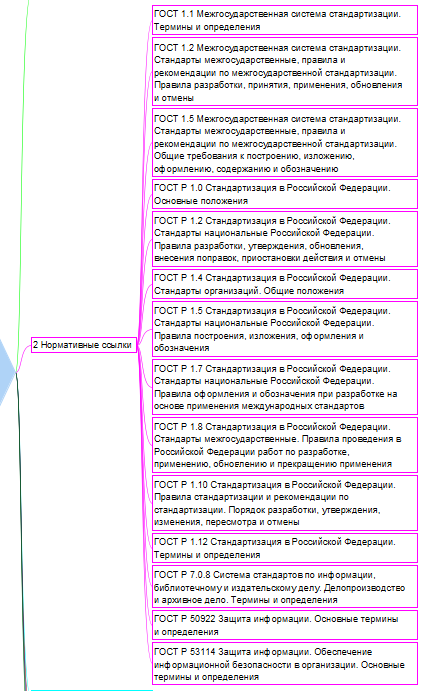
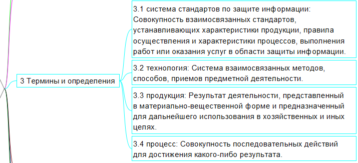
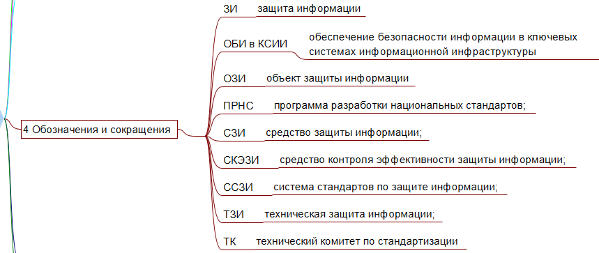
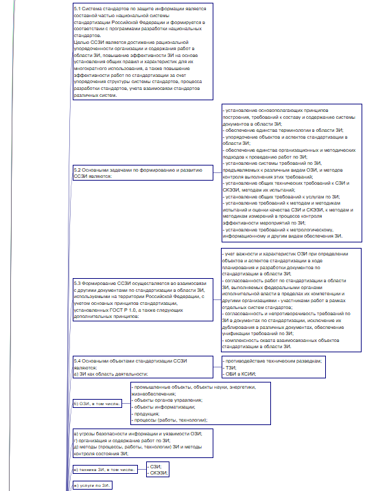
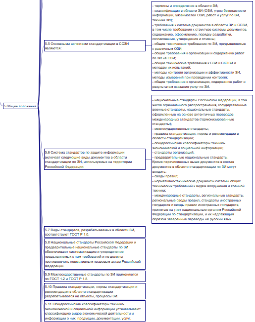
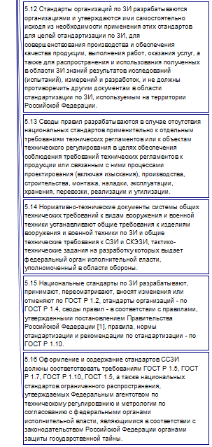
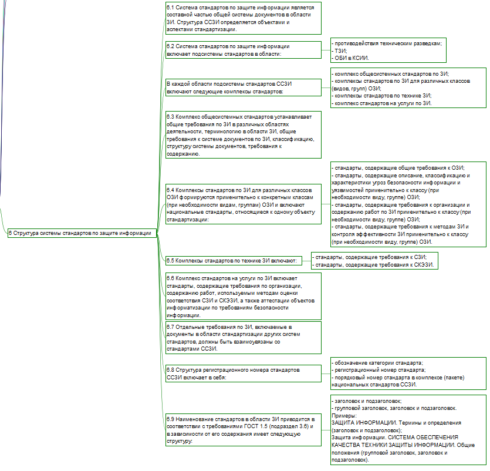

# Изучение ГОСТ
Смирнов Михаил БИСО-03-20

## Цель работы

Изучить ГОСТ по защите информации и познакомиться с построением
mind-карты

## Ход работы

1.  Для построения mind-карты был взят ГОСТ Р 52069.0-2013 Защита
    информации. Система стандартов. Основные положения.

2.  Была использована программа Freeplane

3.  Результат

  
  
  

## Оценка результата

Был изучен ГОСТ Р 52069.0-2013 Защита информации. Система стандартов.
Основные положения и была построена mind-карта в программе Freeplane.

## Вывод

Таким образом, был изучен ГОСТ и правила построения mind-карт.
